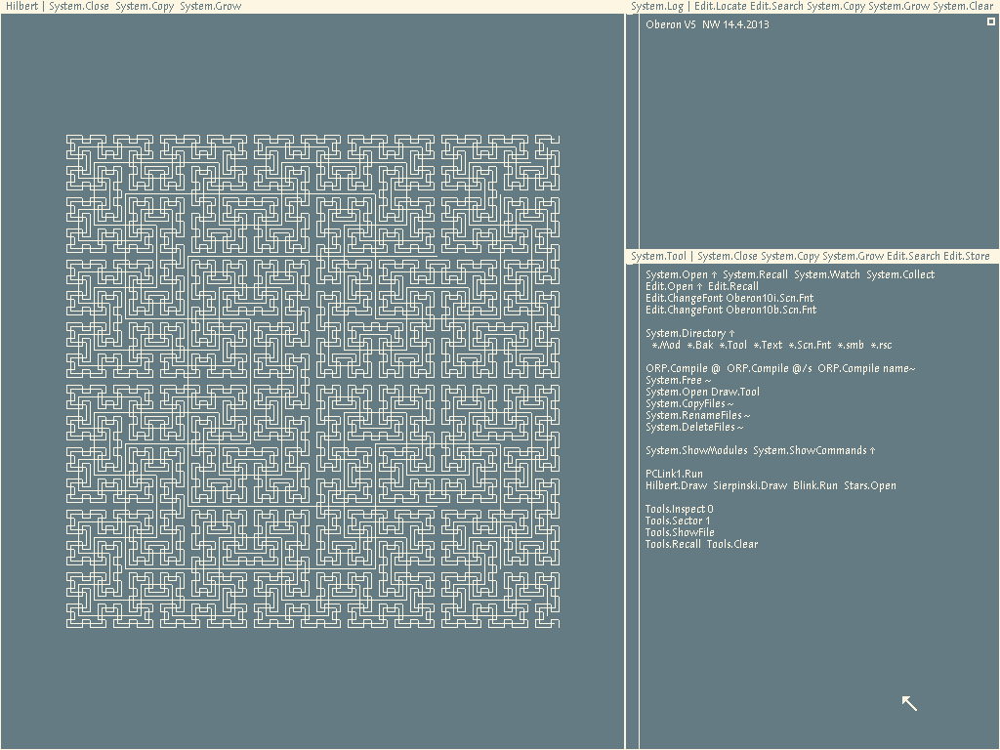

# oberon-risc-emu-rs

A Rust port of Peter De Wachter's [`oberon-risc-emu`](https://github.com/pdewacht/oberon-risc-emu) —
an emulator for Niklaus Wirth's Project Oberon RISC5 machine. It boots a disk
image to the interactive desktop. It can also extract the sources from an Oberon
disk image and rebuild a bootable image from source — for both Project Oberon 2013
and [Extended Oberon](https://github.com/andreaspirklbauer/Oberon-extended), with
no FPGA, external Oberon, or C toolchain.



- **Pure Rust, no system SDL** — [`winit`](https://crates.io/crates/winit) +
  [`softbuffer`](https://crates.io/crates/softbuffer) +
  [`arboard`](https://crates.io/crates/arboard).
- **Workspace** — a dependency-light [`risc-core`](crates/risc-core) library
  (CPU, software FP, MMIO, disk, serial), the top-level `oberon-risc-emu`
  crate (the windowing frontend, which builds the `risc` executable you run),
  and [`host-tools`](crates/host-tools): standalone host utilities for
  Oberon files.
- **Bit-exact to the C reference** — FP vectors, a C-derived boot golden, and
  live co-simulation — save one [documented divergence](DIVERGENCES.md).

## Requirements

- **Rust** — a recent stable toolchain (`rustc` + `cargo`); install via
  [rustup](https://rustup.rs). `cargo` builds everything, and the
  [`Makefile`](Makefile) just wraps the common commands. There's no pinned MSRV,
  but the dependencies track current stable.
- **A display stack (for the GUI)** — the windowing frontend pulls
  [`winit`](https://crates.io/crates/winit),
  [`softbuffer`](https://crates.io/crates/softbuffer), and
  [`arboard`](https://crates.io/crates/arboard); on Linux/BSD it needs the usual
  X11 or Wayland client libraries (e.g. `libxkbcommon`), loaded at run time. The
  [`host-tools`](crates/host-tools) CLIs are pure `std` — Rust is all they need.
- **A C compiler (optional)** — only the `cosim` differential-testing feature
  compiles C (see [Test](#test)); regular builds never invoke it.

## Quickstart

If you already have cargo installed and just want to play with the Oberon system, run:

```sh
make oberon
```

This builds the emulator and boots `Oberon-2020-08-18.dsk` from [`DiskImage/`](DiskImage).

## Other Make targets

A `Makefile` wraps Cargo for the common workflows:

| Command       | What it does                                                          |
| ------------- | -------------------------------------------------------------------- |
| `make`        | build the emulator → `target/release/risc`                           |
| `make tools`  | build the host CLI tools → `target/release/`                         |
| `make test`   | run the whole-workspace test suite                                    |
| `make bench`  | run the render hot-path microbenchmark                                |
| `make clean`  | `cargo clean`                                                         |

`make oberon DISK=other.dsk` boots a different image; the upstream repo has
[other dated versions](https://github.com/pdewacht/oberon-risc-emu/tree/master/DiskImage),
and the [Extended Oberon repo](https://github.com/andreaspirklbauer/Oberon-extended)
has a prebuilt one.

## Controls

Oberon expects a US keyboard layout and a three-button mouse; the left `Alt` key
acts as the middle button. Hotkeys: `F12` / `Ctrl+Shift+Delete` reset · `F11` /
`Alt+Enter` fullscreen · `Alt+F4` quit.

## Command line options

`./target/release/risc [OPTIONS] DISK-IMAGE`:

- `--fullscreen` — start in fullscreen.
- `--mem MEGS` — give the machine more than its default 1 MB of RAM.
- `--size WIDTHxHEIGHT` — use a non-standard framebuffer/window size.
- `--leds` — print LED changes to stdout (handy for kernel work, noisy otherwise).

`./target/release/risc --help` lists the rest (`--zoom`, `--serial-in`/`--serial-out`, `--boot-from-serial`).

## Transferring files

Oberon's `PCLink` (the default serial device) copies files to and from the host:

1. In Oberon, middle-click **`PCLink1.Run`** to start the transfer task.
2. On the host, use upstream's
   [`pcsend.sh` / `pcreceive.sh`](https://github.com/pdewacht/oberon-risc-emu)
   — our protocol is wire-compatible. They drop a `PCLink.REC` (a host file to
   send *to* Oberon) or `PCLink.SND` (a file to receive *from* Oberon) job file
   in the emulator's working directory.

For text, the clipboard is simpler.

## Clipboard integration

The bundled image ships a `Clipboard` module bridging Oberon to the host OS
clipboard (via [`arboard`](https://crates.io/crates/arboard)). Middle-click:

- `Clipboard.Paste` — insert the host clipboard at the caret.
- `Clipboard.CopySelection` — copy the current text selection to the host.
- `Clipboard.CopyViewer` — copy the focused viewer to the host.

## Host tools

The [`host-tools`](crates/host-tools) crate bundles command-line tools for
working with Oberon on the host. `ob2txt`/`txt2ob` convert Oberon source/text to and
from host text and `extract-source` reads a disk image directly; `build-po-image`
and `build-eo-image` run a headless Oberon on
the `risc-core` CPU (a port of
[`project-norebo`](https://github.com/pdewacht/project-norebo)) to build bootable
Project Oberon 2013 and Extended Oberon images. Build them with `make tools`; the
examples below run them straight from `target/release/`.

- **`ob2txt`** / **`txt2ob`** — convert Oberon source/text to and from readable
  host text. Extracted Oberon files are plain Latin-1 with CR line endings;
  `ob2txt A.Mod` writes `A.Mod.txt` (UTF-8/LF), and `txt2ob A.Mod.txt` converts it
  back to `A.Mod`:

  ```sh
  ./target/release/ob2txt A.Mod      # -> A.Mod.txt
  ./target/release/txt2ob A.Mod.txt  # -> A.Mod
  ```

- **`build-po-image`** — compile Project Oberon 2013 from a source tree and
  assemble a bootable disk image (the Norebo toolchain is embedded). Fetch the
  sources separately first, e.g. with project-norebo's `fetch-sources.py`:

  ```sh
  ./target/release/build-po-image path/to/sources out.dsk
  ```

  Files not meant to compile (data, reference modules) go in a required
  `.packonly` manifest in the tree, which `extract-source` generates; custom
  modules compile just by being present (see
  [`crates/host-tools`](crates/host-tools)).

- **`build-eo-image`** — the Extended Oberon counterpart: same pipeline and flags,
  building a bootable EO desktop image from an EO source tree (see
  [`crates/host-tools/BUILD-EO-IMAGE.md`](crates/host-tools/BUILD-EO-IMAGE.md)).

  ```sh
  ./target/release/build-eo-image path/to/eo-sources out.dsk
  ```

- **`extract-source`** — the inverse of the builders: extract the source files
  from a disk image into a host directory (reads the Oberon filesystem directly;
  no boot). Drops compiled `.rsc`/`.smb`, so the result feeds straight back into
  `build-po-image` (or `build-eo-image`):

  ```sh
  ./target/release/extract-source Oberon.dsk out/
  ```

## Known issues

- The wireless network interface is not emulated.
- Raw serial (`--serial-in` / `--serial-out`) is Unix-only.
- Oberon assumes a US keyboard layout.

## Test

```sh
cargo test --workspace    # core + frontend units
cargo test -p risc-core   # core alone, no GUI deps
```

Boot tests are gated on `OBERON_DISK`; point it at the bundled image with an
absolute path (`cargo test` runs each crate's tests from its own directory):

```sh
OBERON_DISK="$PWD/DiskImage/Oberon-2020-08-18.dsk" cargo test
```

- **FP** — ~15k C-generated vectors (`crates/risc-core/tests/data/fp_vectors.txt`).
- **Boot golden** — hashes the framebuffer + CPU state against C at fixed
  checkpoints; regenerated by the C harnesses in `crates/risc-core/tools/`.
- **Image build** — `host-tools`' `build_po_image_round_trips_the_golden` extracts
  the bundled image and rebuilds it, booting the result to that same golden hash.
  It compiles all of Oberon through the shim, so it's `#[ignore]`d (run with
  `cargo test -p host-tools --release -- --ignored`).
- **Live co-simulation** — the `cosim` feature compiles the C reference and
  compares every FP/`idiv` result, a random instruction over random state, and a
  full-boot lockstep, frame by frame. Needs a C toolchain and the sibling C repo:

```sh
OBERON_C_SRC=/path/to/oberon-risc-emu/src \
OBERON_DISK="$PWD/DiskImage/Oberon-2020-08-18.dsk" \
  cargo test -p risc-core --release --features cosim
```

Iteration counts are tunable via `COSIM_FP_ITERS` / `COSIM_INSN_ITERS`; the
render hot path has a `cargo bench` microbenchmark.

### Headless boots

The `headless` subcommand runs the core on the same deterministic 60 Hz clock as
the boot golden — windowless and byte-for-byte reproducible — so it's handy for
CI smoke checks and for regenerating golden hashes:

```sh
# run 250 frames, then print the framebuffer + CPU-state FNV-1a hashes
./target/release/risc headless --frames 250 --hash DiskImage/Oberon-2020-08-18.dsk
```

- `--frames N` — how many 60 Hz frames to boot (default 250).
- `--hash` — print FNV-1a hashes of the framebuffer and the `{PC, R, H, flags}`
  state; these line up with `boot_matches_c_reference`'s checkpoints (at frame
  250 they reproduce the C-derived golden). Omit it for a one-line liveness
  summary (frames run, blank framebuffer words) instead.

It boots a throwaway copy of the image, so the original is left untouched.

## License

[ISC](LICENSE) — the same license as the upstream
[`oberon-risc-emu`](https://github.com/pdewacht/oberon-risc-emu) it ports
(© Peter De Wachter) and Project Oberon itself, so the whole stack is uniform.

Bundled third-party material keeps its own upstream copyright (also ISC):

- `DiskImage/` — Project Oberon 2013 system software (its authors' work, from the
  upstream distribution);
- `crates/host-tools/assets/` — host glue and prebuilt bootstrap objects for the
  image builders, vendored from [`project-norebo`](https://github.com/pdewacht/project-norebo)
  and [Extended Oberon](https://github.com/andreaspirklbauer/Oberon-extended); both
  derive from Project Oberon 2013 (see [`README.md`](crates/host-tools/assets/README.md)).
